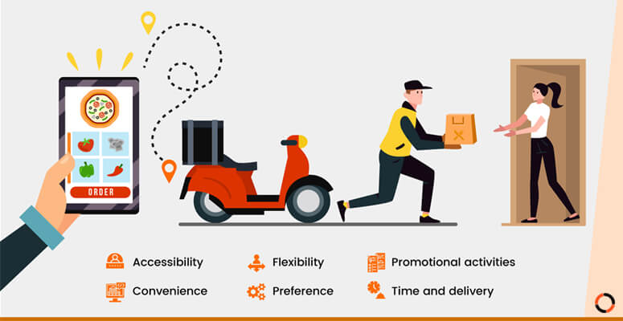

# Zomato Delivery Time Prediction

# 📝Description
This project predicts the estimated delivery time for Zomato food orders using machine learning techniques. It processes historical order data, extracts features, and builds predictive models to estimate delivery times based on various factors such as restaurant location, distance, and traffic conditions.

# 🎯Objectives
- Analyze historical Zomato delivery data
- Perform feature engineering on delivery-related factors
- Train and evaluate machine learning models for predicting delivery time
- Deploy the model for real-world usage

# 🔬Exploratory Data Analysis (EDA)
- Handling missing values
- Outlier detection and removal
- Feature engineering and transformation
- Visualizations (histograms, correlation heatmaps, etc.)

# 📊Dataset
**The dataset includes various features affecting delivery times, such as:**

- Restaurant location 📍
- Delivery distance 🚗
- Weather conditions ☁️
- Traffic levels 🚦
- Order time (peak hours vs. non-peak hours) ⏳

# 🛠Technologies Used
- Python 🐍
- Jupyter Notebook 📓
- Pandas, NumPy for data processing
- Scikit-Learn for machine learning
- Matplotlib, Seaborn for visualization

  # 🎯Usage
- Load the dataset in notebooks/
- Run data preprocessing, feature engineering, and model training
- Evaluate the model and analyze the results

 # 📌Results & Insights
- The best-performing model provides an accuracy of XX%.
- Delivery time is most affected by traffic conditions & distance.
- Machine learning significantly improves Zomato’s estimated times.

# 📢Future Improvements
- 🚀 Integrate real-time traffic data
- 🚀 Improve feature engineering (e.g., road conditions)
- 🚀 Deploy as a cloud-based service
